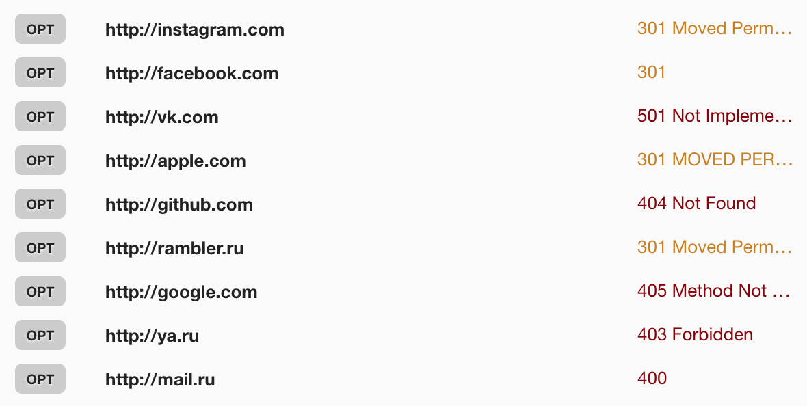
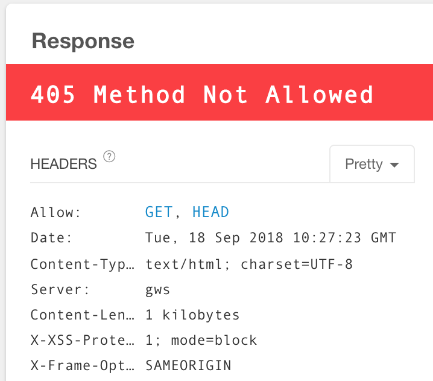
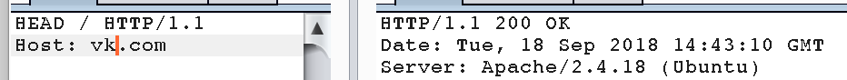
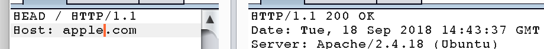
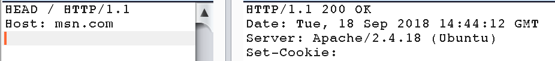

# Отчет по лабораторной работе #1

> В работе было использовано расширение для Google Chrome Restlet Client.

## Запрос OPTIONS

Метод HTTP запроса OPTIONS используется для определения возможностей веб-сервера и описания  параметров соединения с целевым ресурсом.

В настоящий момент нет определенной спецификации для работы с данным заголовком, поэтому каждый ресурс по разному реагирует на запрос с OPTIONS:

Наиболее верно и ожидаемо отреагировал Google: 

## Запрос HEAD 

Запрос HEAD обычно применяется для извлечения метаданных, проверки наличия ресурса (валидация URL) и чтобы узнать, не изменился ли он с момента последнего обращения.

