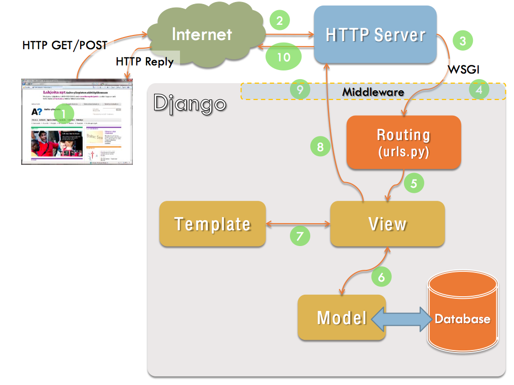

# Лабораторная работа #3
    Выполнили работу Кириллова София и Щербатюк Дарья ИУ7-74
## Разработка архитектуры web приложения

### Название проекта 
Панель администратора для личного блога 

### Постановка проблемы 
Необходимо написать новую административную панель в проекте на Django в связи с тем, что дефолтная панель отображает данные базы данных в неудобной для администратора форме и не предоставляет некоторую необходимую информацию, такую, как: 
- количество посещений страницы в разные периоды времени (день, неделя, месяц);
- статистика по статьям блога.
А также отсутствует гибкий просмотр и редактирование контента. 

Принято решение реализовать в проекте Django новое приложение, полностью заменяющее дефолтную панель. 

### Роль пользователя (USE CASE)

### ER-диаграмма
Ниже представлена ER-диаграмма сущностей, которые представляют определенные типы параграфов, из которых состоит каждая статья в блоге. 

Представить сущности, реализованные во фреймворке, который предлагается использовать(см. пункт ниже), не является возможным в связи с их огромных количеством и неизученными связями между ними. 

### Прототип интерфейса

На данной странице возможен просмотр статистики посещений блога, а также недавней активности и обратной связи.

В разделе показанном выше содержится интструментарий для редактирования публикаций. Ниже диалогое окно для создания новой публикации. 

### Архитектура 
Принято решение об использовании MPA-архитектуры в связи объемным функционалом. Ниже представленная типичная для Django-приложений  модель взаимодействия frontend и backend (MTV). 

Кастомная панель администрация будет реализована как отдельное приложение в django-проекте. Каждое новое view будет представлять собой отдельный класс и обрабатывать поступивший запрос. Модуль models будет описывать сущности, хранящиеся в базе данных. Модуль urls будет играть роль роутинга для доставки запросов до нужного Class-based View.		
	
	

### Техническое решение 

Из имеющегося готового backend-стека и формулировки поставленной задачи следует необходимость использования языка программирования Python в качестве backend-стека. А также было принято решение использовать имеющийся готовый frontend-стек, в котором применяются HTML, CSS и JavaScript. 

#### Технологии кастомизации административной панели
Средства кастомизации административной панели применяются для улучшения управления и функциональности консоли администратора. Существует большое множество библиотек для улучшения административной панели Django. Каждая такая библиотека предоставляет возможность изменить внешний вид административной панели и поддерживает работу с таблицами данных о пользователях, включая сортировку данных таблиц и поиск в них необходимой информации, а также реализацию подключения различных сервисов для создания детальной статистики посетителей веб-сайтов. Среди всех существующих и рассмотренных модулей был выбран Django Jet. 
Преимуществами этой библиотеки для кастомизации административной панели являются: 
- современный дизайн;
- интерфейс администрирования также оптимизирован под мобильные устройства;
- виджеты для быстрого доступа к инструментам администрирования;
- совместимость со сторонними пакетами без изменения шаблона Django;
- легкая интеграция в систему;
- возможность преобразовать все поля внешнего ключа и фильтры с большим количеством данных в выпадающее меню на основе AJAX всего несколькими строками кода.

Исходя из вышеизложенного, было принято использовать именно ее.

